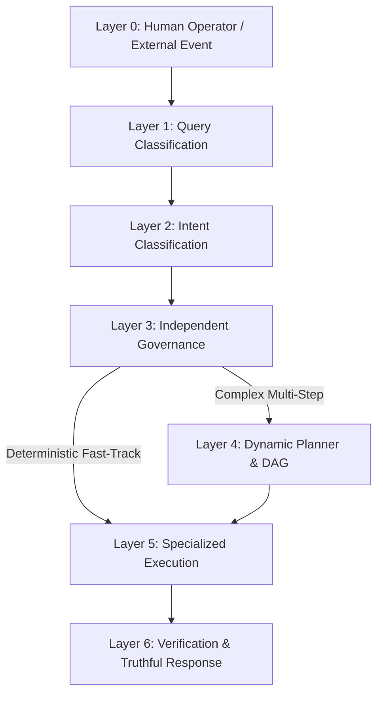

# BABU VISION PLAN 2026

**From Autonomous Automation to Governed Agentic Control Platform**

> Reference: [BABU Manifesto 2026](file:///d:/Aria/BABU_Manifesto_2026.md) & [ADR Book Volume 6](file:///d:/Aria/BABU_ADR_Book_v6.md)

---

## 🎯 Core Operating Principle

**BABU is not a chatbot.**  
**BABU is not a single automation.**  
**BABU is not an LLM wrapper.**  
**BABU is a governed control plane between a human operator and the digital world.**

The fundamental pipeline:
$$\text{Understand} \longrightarrow \text{Classify} \longrightarrow \text{Govern} \longrightarrow \text{Plan} \longrightarrow \text{Execute} \longrightarrow \text{Verify} \longrightarrow \text{Respond}$$

Not:
$$\text{Prompt} \longrightarrow \text{Guess} \longrightarrow \text{Execute}$$

---

## 🏛️ The 7-Layer System Architecture

### 1. Layer 0 — User & Event Ingestion
* **Inputs:** Human natural language commands via JARVIS console (Telegram/HTTP) or inbound Webhook events (Meta Facebook/Instagram).

### 2. Layer 1 — Query Classification
* **Function:** Extracts platform, object, operation, target, scope, constraints, and missing information before any reasoning occurs.

### 3. Layer 2 — Intent Classification
* **Function:** Determines operational objective: `fetch`, `check`, `publish`, `reply`, `analyze`, `create`, `send`, `search`, `verify`, `execute`, or `escalate`.

### 4. Layer 3 — Independent Governance
* **Function:** Evaluates authority, policy limits, permissions, and safety rules.
* **Core Rule:** $\text{Understanding} \neq \text{Authorization} \neq \text{Execution}$.

### 5. Layer 4 — Dynamic Planning (Or Orchestration Bypass)
* **Deterministic Fast-Track:** Routine/single-capability requests bypass heavy dynamic LLM planning directly to capability tools.
* **Dynamic Orchestration:** Complex goals are decomposed into multi-agent DAG execution steps.

### 6. Layer 5 — Specialized Execution
* **Function:** Invokes narrow-scope worker nodes against real APIs (Google Workspace, Meta Facebook, PostgreSQL, DuckDuckGo, Pollinations.ai).

### 7. Layer 6 — Verification & Truthful Response
* **Function:** Audits output against anti-pattern rules. Reports success, failure, or degraded state honestly without simulating success.

---

## 🚀 Key Strategic Priorities for 2026

### 1. Bidirectional Meta Ecosystem Integration
Expand BABU from outbound posting into a unified, event-driven control plane for Meta Facebook Page, Messenger DMs, Instagram, and WhatsApp.

### 2. Multi-Provider Intelligence Resilience
Maintain zero single-provider dependency:
* 🥇 **Primary**: Groq Cloud API (`groq/compound-mini`, `groq/compound`, `openai/gpt-oss-120b`)
* 🥈 **Secondary**: NVIDIA NIM API (`nvidia/meta/llama-3.3-70b-instruct`)
* 🥉 **Third**: Google Gemini Native (`gemini-2.5-flash`)

### 3. Authoritative Business Knowledge Grounding
Store structured business facts in `business_profile.json` so BABU retrieves verified pricing, services, and FAQs rather than improvising.

### 4. Truthful Degradation & Non-Simulation
If an infrastructure endpoint is rate-limited or unavailable, state the limitation honestly rather than generating fake success.

---

*BABU Vision Plan 2026 — Governed Control Platform Standard*
