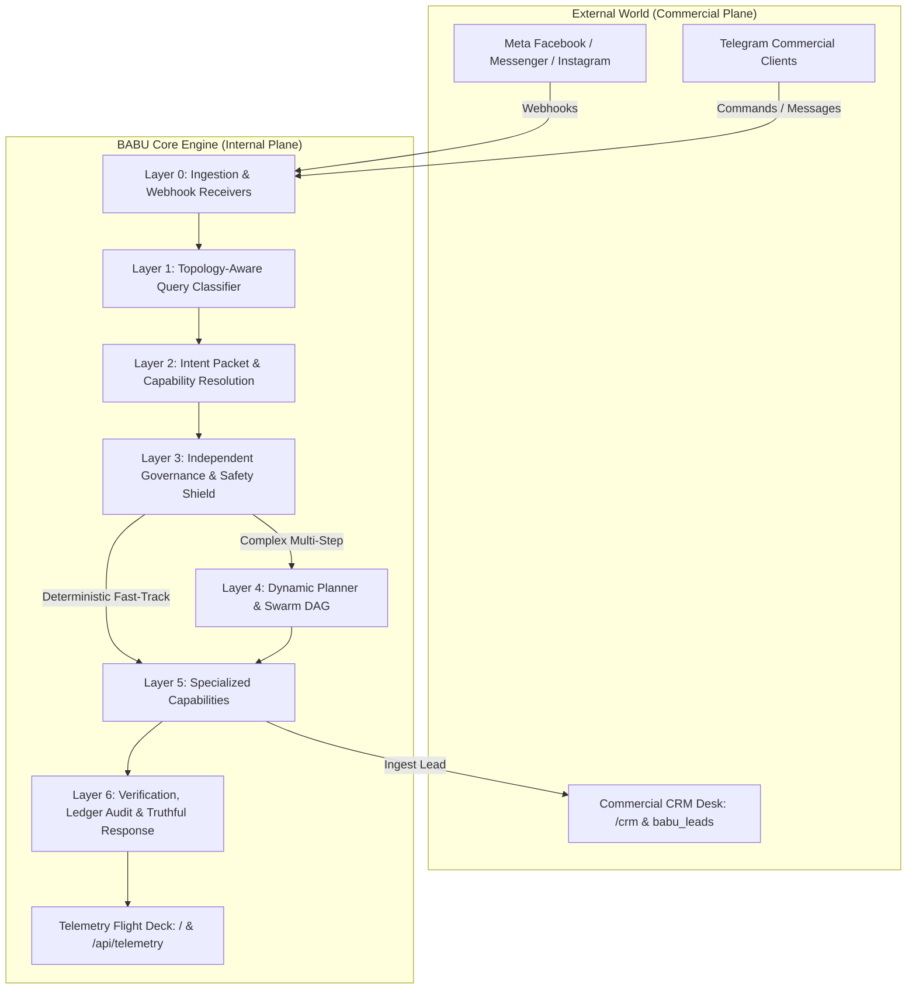

# BABU VISION PLAN 2026

**From Autonomous Automation to Governed Agentic Control Platform**

> Reference: [BABU Manifesto 2026](file:///d:/Aria/BABU_Manifesto_2026.md) & [ADR Book Volume 6](file:///d:/Aria/BABU_ADR_Book_v6.md)

---

## 🎯 Core Operating Principle

**BABU is not a chatbot.**  
**BABU is not a single automation.**  
**BABU is not an LLM wrapper.**  
**BABU is a governed control plane between a human operator and the digital world.**

The fundamental pipeline:
$$\text{Understand} \longrightarrow \text{Classify} \longrightarrow \text{Govern} \longrightarrow \text{Plan} \longrightarrow \text{Execute} \longrightarrow \text{Verify} \longrightarrow \text{Respond}$$

Not:
$$\text{Prompt} \longrightarrow \text{Guess} \longrightarrow \text{Execute}$$

---

## 🏛️ The 7-Layer System Architecture & Dual-Plane Separation

### 🏢 Strict Dual-Plane Architectural Decoupling
To maintain absolute engineering clarity and commercial focus, BABU maintains two strictly separated domains:

1. **BABU Internal Flight Deck (Telematics)**:
   - *Target Audience:* System Operators & BABU Self-Analysis.
   - *Scope:* Token consumption, model latencies, DAG execution traces, K0–K7 memory access, recovery invocations, anti-pattern checks.
   - *Interfaces:* `/` (Live Cockpit UI) and `/api/telemetry`.

2. **Business Commercial Desk (CRM)**:
   - *Target Audience:* Anshu Computer & Tax Consultancy Business Operations.
   - *Scope:* Client inquiries, lead status (`NEW`, `CONTACTED`, `APPOINTMENT_SCHEDULED`, `CONVERTED`, `LOST`), service categories (`ITR`, `GST`, `PF`, `PAN`, `Accounting`), interaction history, and appointment calendar.
   - *Interfaces:* `/crm` (CRM Operating Desk UI), `/api/crm`, `/api/crm/lead/update`, and Telegram business suite (`/crm`, `/leads`, `/add_lead`).

---

### 1. Layer 0 — User & Event Ingestion
* **Inputs:** Human natural language commands via JARVIS console (Telegram/HTTP) or inbound Webhook events (Meta Facebook Page Comments & Messenger DMs).

### 2. Layer 1 — Query Classification
* **Function:** Extracts platform, object, operation, target, scope, constraints, and missing information before any reasoning occurs.

### 3. Layer 2 — Intent Classification
* **Function:** Determines operational objective: `fetch`, `check`, `publish`, `reply`, `analyze`, `create`, `send`, `search`, `verify`, `execute`, or `escalate`.

### 4. Layer 3 — Independent Governance
* **Function:** Evaluates authority, policy limits, permissions, and safety rules.
* **Core Rule:** $\text{Understanding} \neq \text{Authorization} \neq \text{Execution}$.

### 5. Layer 4 — Dynamic Planning (Or Orchestration Bypass)
* **Deterministic Fast-Track:** Routine/single-capability requests bypass heavy dynamic LLM planning directly to capability tools (<0.1s).
* **Dynamic Orchestration:** Complex multi-domain goals are decomposed into multi-agent DAG execution steps executed by specialized swarm workers.

### 6. Layer 5 — Specialized Execution
* **Function:** Invokes narrow-scope worker nodes against real APIs (Google Workspace, Meta Facebook Graph API, PostgreSQL, DuckDuckGo, Pollinations.ai).

### 7. Layer 6 — Verification & Truthful Response
* **Function:** Audits output against anti-pattern rules. Records execution to `babu_k0_working_memory`, `execution_ledger`, and `babu_temporal_timeline`.

---

## 🚀 Key Strategic Priorities for 2026

### 1. Production Model Matrix & Default Swarm Calibration
- **Personal Assistant (PA):** Defaulted to `openai/gpt-oss-120b` (Model 3) for elite conversational synthesis and architectural depth.
- **Swarm Workers & Social Webhook Engine:** Defaulted to `openai/gpt-oss-20b` (Model 4) for lightning-fast (<0.3s) execution with zero rate-limit overhead.
- **Multi-Provider Fallback Cascade:** Dynamic failover across Groq Cloud, NVIDIA NIM, and Google Gemini Native.

### 2. Live Social CRM & Bidirectional Engagement
- Inbound Facebook comments and Messenger DMs receive zero-latency contextual replies and are automatically persisted into `babu_k0_working_memory`, `execution_ledger`, and the `babu_leads` commercial database table.

### 3. Authoritative Business Knowledge Grounding
- Structured facts stored in `business_profile.json` and Supabase PostgreSQL ground all client communications on verified pricing, deadlines (GST 11th/20th, PF 15th, ITR 31st July), and address details.

### 4. Truthful Degradation & Non-Simulation
- If an infrastructure endpoint is rate-limited or unavailable, BABU states the limitation honestly rather than generating fake success.

---

*BABU Vision Plan 2026 — Governed Control Platform Standard*
