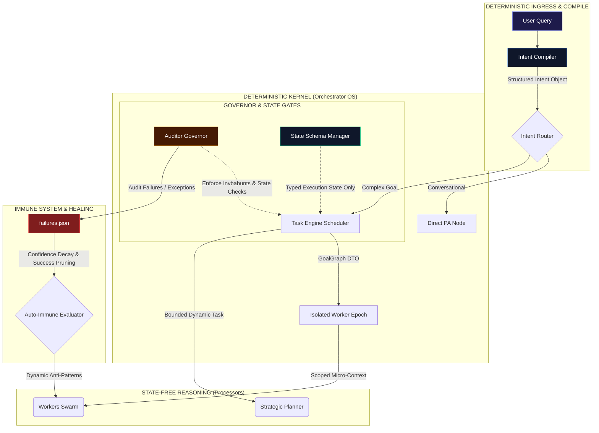

# BABU: Distributed Cognitive Operating System Blueprint
### Systems Architectural Design & Engineering Specifications

This document outlines the architectural roadmap to transition BABU from a multi-agent orchestration assistant into a highly resilient, deterministic, **bounded cognitive operating system**. It directly addresses structural vulnerabilities, introduces failure-decay equations to prevent autoimmune pathology, formalizes intent compilation, and expands the auditor into an active governance kernel.

---

## 1. The Dynamic System Topology

The diagram below maps the proposed architecture. The **Intent Compiler** acts as an initial deterministic gate, translating natural language into typed intent contracts before the planner or workers ever execute.



---

## 2. Priority 1 & 5: Intent Compiler Layer & Deterministic Planning

### The Intent Compiler
Direct prompt-driven planning creates unstable execution graphs. To guarantee absolute reproducibility at runtime, we introduce a dedicated **Intent Compiler** layer *before* task planning.

The Intent Compiler processes the user's natural query and outputs a strongly typed **Intent Contract**:

```python
class IntentType(str, Enum):
    INFO_RETRIEVAL = "information_retrieval"
    ACTION_MUTATION = "action_mutation"
    CONVERSATIONAL  = "conversational_greeting"
    DIAGNOSTIC      = "diagnostic_command"

class RiskLevel(str, Enum):
    LOW    = "low"
    MEDIUM = "medium"
    HIGH   = "high"

@dataclass
class IntentContract:
    intent_type: IntentType
    requires_action: bool
    action_domain: Optional[str]      # e.g., 'email', 'sheets', 'calendar'
    requires_persistence: bool
    delivery_mode: str                # 'chat', 'email', 'file_draft'
    risk_level: RiskLevel
    intent_confidence: float
```

### Deterministic Plan Gating
During planning, the Strategic Planner accepts the compiled `IntentContract` alongside the raw query. If `IntentContract.requires_action` is `False`, the planner **refuses** to generate any execution department tasks:

```python
def enforce_planning_invbabunts(intent: IntentContract, graph: GoalGraph) -> None:
    """Enforce strict compile-time boundaries on the planner's DAG generation."""
    for task in graph.tasks:
        if task.department == "execution" and not intent.requires_action:
            raise GovernanceViolationError(
                f"Security Refusal: Planner attempted to schedule execution task '{task.task_id}' "
                f"for non-mutation intent '{intent.intent_type.value}'"
            )
```

This mathematical guard ensures that casual information requests never cascade into side-effect mutations.

---

## 3. Healing the Immune System: Expiration & Confidence Decay

### The Danger: Pathological Self-Conditioning
A single transient network timeout (e.g. an API gateway timeout) currently writes a permanent execution failure anti-pattern. Over time, the bot becomes overly defensive, execution-avoidant, and functionally crippled. This is **immune overreaction** (computational autoimmune disease).

### The Solution: Confidence Decay & Healing Equations
Failure memory must not be permanent. It must act as a **pliable, decaying state** that heals over time as the system executes actions successfully.

We define the active strength of an anti-pattern rule as a function of its **historical confidence** $C$, which decays dynamically with every successful method execution.

$$\begin{aligned}
C_{new} &= C_{old} \times (1 - \lambda \times S) \\
\text{where:} & \\
S &= \text{number of consecutive successful executions} \\
\lambda &= \text{decay coefficient (default: 0.15)}
\end{aligned}$$

We update the `failures.json` schema to include healing metrics:

```json
{
  "failure_signature": "ACTION.SEND_EMAIL_20260528_180000",
  "domain": "action.send_email",
  "attempted_methodology": "send_email(to, subject, body)",
  "observed_consequence": "SMTP Connection Timeout",
  "active_anti_pattern_rule": "Avoid SMTP direct routing when connection state is unverified.",
  "confidence": 1.0,
  "decay_rate": 0.15,
  "success_count": 0,
  "last_tested": "2026-05-28T18:00:00Z",
  "ttl_sessions_remaining": 20
}
```

### The Healing Scheduler
Every time an execution task under a specific domain completes successfully, the **Immune Evaluator** updates and prunes `failures.json`:

```python
def register_successful_execution(domain: str) -> None:
    """Register successful method run to decay failure rules and heal the immune system."""
    with FAILURES_LOCK:
        failures = load_failures()
        updated_failures = []
        
        for entry in failures:
            if entry.get("domain") == domain:
                # Increment success tracking and decay confidence
                entry["success_count"] += 1
                decay = entry.get("decay_rate", 0.15)
                entry["confidence"] = max(0.0, entry["confidence"] * (1 - decay))
                entry["ttl_sessions_remaining"] -= 1
                
                # Pruning threshold check
                if entry["confidence"] < 0.25 or entry["ttl_sessions_remaining"] <= 0:
                    print(f"[IMMUNE SYSTEM] Healed anti-pattern '{entry['failure_signature']}' from memory.", flush=True)
                    continue # Rule is wiped completely
            updated_failures.append(entry)
            
        save_failures(updated_failures)
```

---

## 4. Priority 2 & 3: Structured State Schemas & Memory Segmentation

To maximize stability, we establish a strict taxonomy separating system state vbabubles from raw conversational text.

### Strictly Segmented Memory Architecture

```
┌────────────────────────────────────────────────────────────────────────┐
│                        COGNITIVE OS MEMORY SYSTEM                      │
└────────────────────────────────────────────────────────────────────────┘
     │
     ├─► [Transient Task Memory] ────► Contained in SQLite 'writes'
     │                                 Wiped completely on epoch seal.
     │
     ├─► [Auto-Immune Failure Memory] ◄► failures.json
     │                                 Decaying, self-healing anti-patterns.
     │
     ├─► [Identity Context Memory] ──► user_profile.json
     │                                 Core identities & static facts.
     │
     └─► [System Policy Invbabunts] ─► Static, non-modifiable validation schemas.
```

### Structured State Schema
We restrict raw textual logs, replacing them with typed DTO pointers and tracked state vbabubles in the main LangGraph State dictionary (`BabuState`):

```python
class BabuState(TypedDict):
    messages:       Annotated[list[BaseMessage], "Conversation"]
    research_data:  List[str]
    user_query:     str
    history_text:   str
    session_id:     str
    search_results: str
    action_result:  str
    tokens:         Annotated[dict, add_tokens]
    detected_action: Optional[dict]
    active_goal:    Optional[dict]
    execution_tracker: dict
    compressed_research: str
    routing_metadata: dict
    pending_action_notice: str
    goal_graph:     Optional[dict]
    execution_log:  list[dict]
    final_brief:    str
    knowledge_classes: Optional[List[str]]
    source_records: Optional[List[str]]
    conversation_reference: Optional[bool]
    is_deterministic_response: Optional[bool]
```

---

## 5. Priority 4: Auditor Authority Expansion (Validator to Governor)

Currently, the `BipartiteAuditor` acts as a static validator, raising error alerts or blocking task progression. To establish true operating system boundaries, the auditor is refactored into a **Governance Kernel** with explicit operational authorities:

```
                  [Auditor Governor Check]
                             │
            ┌────────────────┴────────────────┐
            ▼                                 ▼
     [PASS (Green Signal)]             [FAIL (Violation)]
            │                                 │
     Proceed to next Task                     ├─► [DENY] Block thread execution
                                              ├─► [ROLLBACK] Revert database states
                                              ├─► [QUARANTINE] Isolate worker payload
                                              └─► [REVOKE] Invalidate active session tokens
```

*   **Deny Authority**: Instantly refuses tool execution if parameter verification fails.
*   **Rollback Authority**: If a downstream task fails the compliance checklist post-audit, the Governor issues a rollback signal to revert database changes made during the epoch.
*   **Quarantine Authority**: Isolates unverified outputs. When a worker produces high-entropy or potentially compromised text, the Governor places the data in an isolated quarantine sandbox, preventing subsequent workers from reading the payload.
*   **Revoke Authority**: Programmatically revokes session authorization tokens if access patterns exhibit high anomaly scores, safeguarding core Google Workspace integrations.

---

## 6. Realization and Engineering Milestones

This blueprint has transitioned BABU beyond conversational software toward a highly reliable, durable cognitive runtime. 

> [!NOTE]
> **Completed Milestones**
> 1. Restructured `bot.py` into a modular layered architecture: `gateway.py` (Layer 0), `services.py` (Layer 4), `graph.py` (Orchestration nodes), and a lean `bot.py` entry point.
> 2. Implemented Class C destructive service double-confirmation workflow using `BabuState` keys (`pending_action_notice`, `detected_action`) to interrupt and request user warning confirmation.
> 3. Standardized `BabuState` to track structured execution logs, token budgets, and metadata across LangGraph nodes.
