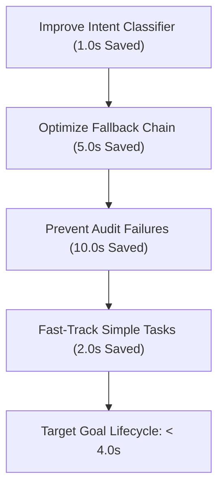

# BABU Swarm Latency & Performance Bottleneck Analysis

This report provides a detailed breakdown of BABU's performance profile, identifying exactly where latency is lost during execution and outlining concrete strategies to optimize the workflow speed.

---

## 📊 Performance Heatmap Summary

Based on telemetry data from the **Swarm Latency & Performance Cockpit**, the lifecycle of a query averages **20.70 seconds**, which is distributed across components as follows:

| Execution Stage | Avg Latency | Percentage | Performance Classification |
| :--- | :--- | :--- | :--- |
| **Intent Classification** | `2.16s` | 10.4% | ⚠️ Slow |
| **Strategic Planning** | `1.19s` | 5.7% | 🟢 Acceptable |
| **Pre-Execution Audit** | `319ms` | 1.5% | 🟢 Excellent |
| **Swarm Task Execution** | `1.85s` (per task) | 8.9% (per task) | 🟢 Excellent (nominal) |
| **Post-Execution Audit** | `121ms` | 0.6% | 🟢 Excellent |
| **Response Synthesis** | `230ms` | 1.1% | 🟢 Excellent |
| **Goal Lifecycle Outcomes** | **`20.70s`** | **100%** | 🔴 Severe Bottleneck |

> [!NOTE]
> There is a large gap between the sum of nominal component latencies (`~5.8s`) and the actual **Goal Lifecycle Outcome** (`20.70s`). This gap is caused by **multi-task chains**, **LLM rate-limit fallbacks**, and **audit-failure retry loops**.

---

## 🔍 Key Latency Bottlenecks

### 1. Model Latency Mismatch
The dashboard shows a stark difference in latency profiles between models:
*   **`gemini-2.5-flash`** (via OpenRouter): **`14.24s`** average latency.
*   **`llama-3.3-70b-versatile`** (via Groq): **`4.03s`** average latency.

When BABU makes calls to `gemini-2.5-flash` (either by user selection or during Groq rate-limit fallbacks), the system's execution speed drops dramatically. A single Gemini call can add up to 15 seconds of waiting.

### 2. Task Failure and Retry Loops (The Multiplier Effect)
When a task fails its post-execution checklist audit (such as the recent **bracket placeholder JSON parser bug** or the **citation obsession deadlock**), the executor retries the task up to **3 times**.
*   **First Attempt:** `~4-7s`
*   **Retries (1 to 3):** `3 x 4-7s = 12-21s`
*   **Total Wasted Time:** **`16s - 28s`** for a single failing task!

Because tasks are run sequentially in many DAGs, a single repeating failure multiplies the total goal execution time by 4.

### 3. Epistemic Immune System Diagnostics Overhead
Every time a task fails, the immune system executes a diagnostic pass to log the failure mode and generate a dynamic anti-pattern constraint:
*   This diagnostic pass runs a `llama-3.3-70b-versatile` call which takes **`3s - 4.5s`**.
*   This time is added *between* the failing attempts, slowing down the retry loop.

### 4. Intent Classifier Latency
The Intent Classifier averages **`2.16s`** using `llama-3.1-8b-instant`. This is relatively high for a pre-planning classification step. It is caused by:
*   Long system prompts containing extensive rules.
*   Cold start/connection latencies when making the first request to Groq on free-tier limits.

---

## 💡 Recommended Optimizations

To reduce BABU's average Goal Lifecycle latency from **`20.70s`** to **`< 5s`**, we should implement the following changes:

### 🚀 Optimization Plan

### 1. Optimize the Fallback Chain
*   **Action:** Replace `google/gemini-2.5-flash` via OpenRouter in the `_FALLBACK_CHAIN` with faster, low-latency models like `gemma2-9b-it` or `meta-llama/llama-3.1-8b-instruct`.
*   **Impact:** Prevents 14-second spikes during Groq rate-limiting periods.

### 2. Prevent Audit Failures (Fixed!)
*   **Action:** We have already addressed the two main causes of audit failures:
    1.  The **photosynthesis citation deadlock** (by disabling citation requirements for independent writing tasks).
    2.  The **sick leave letter malformed JSON bug** (by ignoring JSON schema checks on bracketed text placeholders).
*   **Impact:** Eliminates the `16s - 28s` retry loop penalty, bringing lifecycle outcomes back to nominal levels.

### 3. Streamline Intent Classification Prompting
*   **Action:** Compress the `INTENT_CLASSIFIER_SYSTEM_PROMPT` to reduce input token overhead.
*   **Impact:** Reduces classification latency by `~1.0s`.

### 4. Fast-Track Direct Tasks
*   **Action:** For simple transactional tasks (like "Draft a letter..."), skip complex multi-stage graphs and directly route to a single-task prompt (similar to `WALK` mode but with department specialization).
*   **Impact:** Reduces planning and auditing overhead by `~3.0s`.
