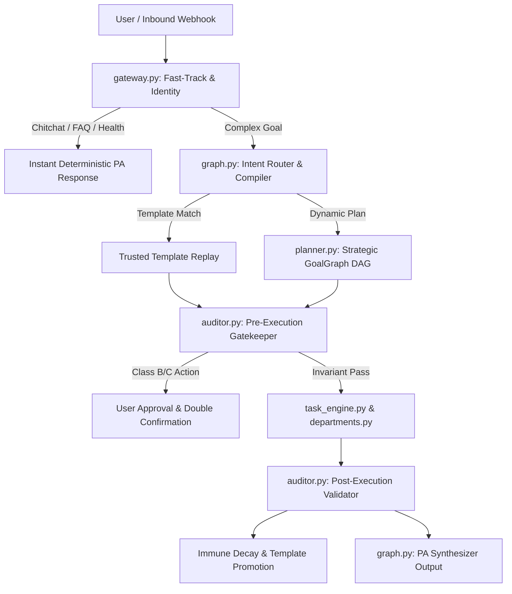

# BABU — Governed Cognitive Operating System & Control Platform

BABU is a bounded, resilient, multi-agent Cognitive Operating System and Governed Control Platform accessible via Telegram and Web interfaces. It enforces deterministic governance gates, hierarchical retrieval, dynamic task DAG execution, and multi-provider LLM failover.

> Reference: [BABU Vision Plan 2026](file:///d:/Aria/BABU_VISION_PLAN_2026.md) & [BABU Manifesto 2026](file:///d:/Aria/BABU_Manifesto_2026.md)

---

## Run & Operate

- `python bot.py` — run the BABU bot (Telegram webhook/polling + web chat API + health server)
- `pnpm --filter @workspace/babu-web run dev` — run the status/chat web UI
- `pnpm run typecheck` — full typecheck across web packages
- `pytest` — run comprehensive test suites (intent governance, orchestration, memory, RAG)

---

## Required & Optional Secrets

| Secret | Purpose | Required? |
|---|---|---|
| `GROQ_API_KEY` | Primary LLM Provider (openai/gpt-oss-120b, openai/gpt-oss-20b via Groq API) | Required |
| `TELEGRAM_BOT_TOKEN` | Telegram Bot Token for direct human-operator interaction | Required for Bot |
| `GEMINI_API_KEY` | Secondary/Tertiary LLM & Embeddings fallback (`gemini-2.5-flash`, `text-embedding-004`) | Optional |
| `OPENROUTER_API_KEY` | Multi-model failover provider | Optional |
| `FACEBOOK_PAGE_ACCESS_TOKEN` | Meta Facebook Graph API publishing token | Optional (Social Media) |
| `FACEBOOK_PAGE_ID` | Facebook Business Page Identifier | Optional (Social Media) |

---

## Technology Stack

- **Runtime:** Python 3.11+ / Node.js (Vite + React)
- **Bot Engine:** `python-telegram-bot`
- **Orchestration:** LangGraph `StateGraph` with durable SQLite/PostgreSQL checkpointers
- **LLM Failover Swarm:**
  - 🥇 Primary: Groq API (`openai/gpt-oss-120b` for Strategic Planner & PA, `openai/gpt-oss-20b` for Swarm Workers & Webhooks; legacy Llama models discontinued)
  - 🥈 Secondary: NVIDIA NIM API / OpenRouter
  - 🥉 Tertiary: Google Gemini Native (`gemini-2.5-flash`)
- **Web Search:** Tavily Search API (`TAVILY_API_KEY`) with fallback to DuckDuckGo (`ddgs`), augmented with live Wikipedia research
- **Intent Taxonomy:** 7-domain typed taxonomy (`COMMUNICATION`, `WORKSPACE`, `BUSINESS_INFORMATION`, `PERSONAL_INFORMATION`, `SYSTEM_INFORMATION`, `CONVERSATION`, `PUBLIC_INFORMATION`)
- **Persistence & Ledgers:** PostgreSQL (Supabase) + SQLite (`execution_ledger`, `trusted_templates`, `pending_actions`, `search_cache`, `system_memory`)
- **Governance:** E0 Constitutional Rules (`e0/constitution.json`, `e0/policies.json`) + Bipartite Pre/Post Auditor
- **Action Dispatch (ADR-104):** Direct single/double-confirmation dispatch on approval without planner re-invocation, preserving upstream drafted contexts and RFC parameter formatting.

---

## Where Things Live

```
├── bot.py               ← Telegram polling/webhook loops, CLI entry point, API server
├── gateway.py           ← Layer 0/1: Fast-track short-circuits, chitchat, health dashboard, profile facts
├── graph.py             ← Layer 1/2: LangGraph StateGraph, Intent Routing, Task Executor, PA node
├── planner.py           ← Layer 2/4: Intent Compiler, GoalGraph DAG generator, trusted template replay
├── auditor.py           ← Layer 3/6: Bipartite Pre-Execution Gatekeeper & Post-Execution Validator
├── task_engine.py       ← Layer 5: Topological Task Engine scheduler & Token Governance Caps
├── departments.py       ← Layer 5: Department heads (Research, Information, Analysis, Writing, Execution)
├── services.py          ← Layer 4: SQLite database, token extraction, temporal events, profile search
├── system_index.py      ← Layer 3: System Information Index (SII) markdown parser & ADR routing
├── rag_storage.py       ← Layer 4: Vector embedding factory (Gemini -> Mock fallback) & Hybrid Search
├── memory.py            ← Epistemic immune system, failure decay tracking, context compression
├── social_media.py      ← Autonomous tax/compliance marketing campaigns & visual card rendering
├── e0/                  ← Immutable constitutional safety rules and governance policies
└── artifacts/           ← Web status dashboard and chat user interface
```

---

## 7-Layer Architecture Pipeline

$$\text{Understand (L0/L1)} \longrightarrow \text{Classify (L2)} \longrightarrow \text{Govern (L3)} \longrightarrow \text{Plan (L4)} \longrightarrow \text{Execute (L5)} \longrightarrow \text{Verify (L6)} \longrightarrow \text{Respond}$$



---

## Service Class Safety Gates

| Class | Description | Confirmation Workflow | Examples |
|---|---|---|---|
| **Class A** | Read-Only & Retrieval | Auto-Approved | `search_sheet`, `search_gmail`, `web_search` |
| **Class B** | External State Mutations | Single Approval Required | `send_email`, `create_event`, `post_to_facebook` |
| **Class C** | Destructive Actions | Double Confirmation Required (`Draft -> Preview -> Approve -> Warning/Confirm -> Execute`) | `delete_document`, `bulk_delete`, `delete_event` |

---

## Telegram Bot Commands

| Command | Handler | Purpose |
|---|---|---|
| `/promote <sig> <goal_id>` | `cmd_promote` | Compile successful workflow into a trusted execution template |
| `/retire <sig>` | `cmd_retire` | Permanently retire an obsolete or degraded template |
| `/goals` | `cmd_goals` | Display active and pending goal executions |
| `/stats` | `cmd_stats` | View token expenditures, latency, and template metrics |
| `/model <name>` | `cmd_model` | Inspect or switch active LLM failover providers |
| `/postnow` | `cmd_postnow` | Manually trigger daily tax/compliance marketing post creation |
| `/launch` | `cmd_launch` | Launch execution swarm |
| `/clear` | `cmd_clear` | Reset active session memory and transient state |
| `/help` | `cmd_help` | Display comprehensive command list |

---

## Key Operational Rules & Gotchas

1. **Deterministic Fast-Path**: Common greetings, profile lookups, and system health queries bypass heavy LLM planning for sub-100ms response times.
2. **Self-Healing Immune System**: Failures recorded in `failures.json` decay automatically upon subsequent successful method executions ($C_{new} = C_{old} \times (1 - 0.15 \times S)$), preventing permanent blockage from temporary network drops.
3. **No Simulated Success**: If an external API or model fails, BABU reports the real error state truthfully rather than hallucinating success.

