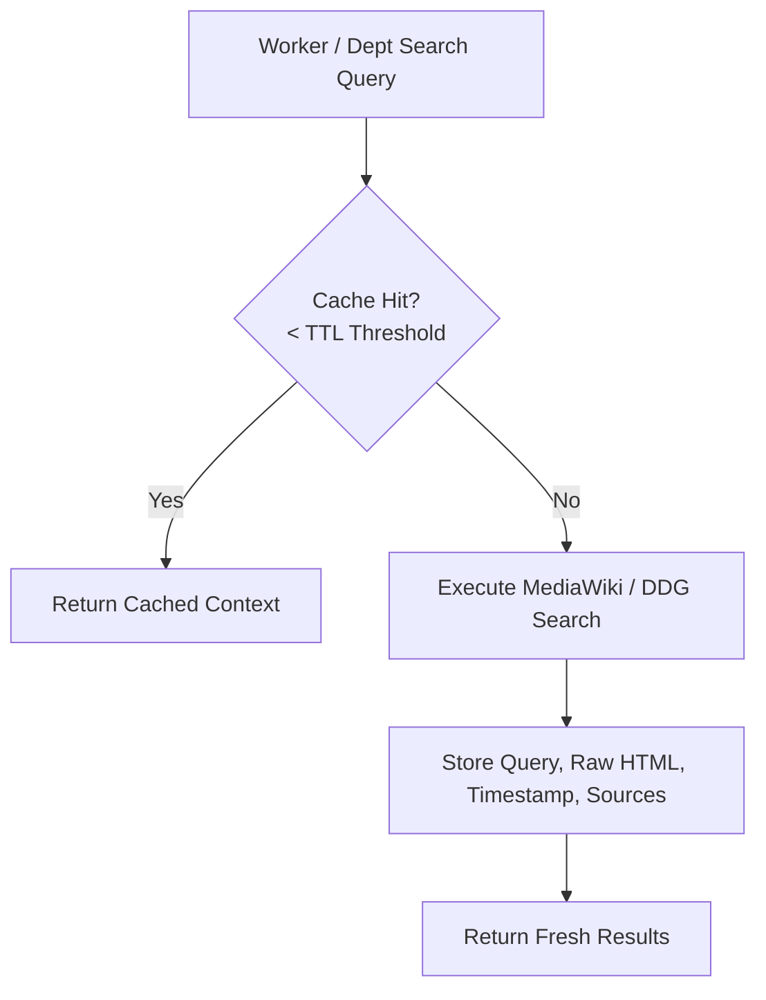

# BABU Cognitive OS: Retrieval & Auditability Assessment

This report provides a formal architectural analysis of BABU's Phase 9 upgrades (Wikipedia RAG, search inheritance, and conversational mode separation), evaluates the system's current bottlenecks and risks, and designs structural blueprints to transition BABU into a production-grade, bounded orchestration operating layer.

---

## 🏗️ Part 1: What Actually Improved (Pros & Architecture Wins)

### 1. Unified Wikipedia RAG + Web Search Fusion
Historically, agent search architectures suffered from either **temporal blindness** (pure vector store search over outdated knowledge) or **hallucinated noise** (pure web search scanning raw, unverified search pages). 
By fusing Wikipedia and DuckDuckGo inside a single unified search layer, BABU achieves a powerful RAG equilibrium:

$$\text{Search Accuracy} = \text{Canonical grounding (Wikipedia)} + \text{Real-time freshness (DDG)}$$

*   **Wikipedia** establishes the *ground truth* (canonical entity definitions, terminology, historical context, and correct spellings).
*   **DuckDuckGo** captures the *dynamic delta* (breaking news, current statistics, and temporal shifts).
*   **Result**: Factual anchoring is vastly improved, shielding the downstream departments from processing raw web spam or outdated knowledge.

### 2. Search Inheritance Abstraction
Instead of equipping dozens of specialized worker prompts with ad-hoc search instructions—which blows up prompt token weight and increases instruction-following failures—BABU abstracts search completely down to the **Infrastructure Layer** (`web_search` in `bot.py`).
*   **Low Cognitive Overhead**: The Strategic Planner (`planner.py`) and worker agents do not need to manage search logic or API parameters. They simply declare their objectives.
*   **Modular Upgrades**: Refining search behavior, switching API endpoints, or adding new content aggregators (e.g. PubMed or ArXiv) can be done inside a single helper without altering worker prompts or graph nodes.

### 3. Lightweight Conversational Fast Path (WALK mode)
The integration of `should_escalate_to_workflow()` separates natural user dialogues and greetings from heavy project workflows.
*   **Bypassing the Swarm**: A simple greeting (e.g. *"Hi buddy"*) bypasses `planner`, `executor`, and `auditor` nodes entirely.
*   **Token & Latency Metrics**:
    *   *Complex Workflow (LAUNCH)*: Engaging full LLM planning, topological task scheduling, pre/post execution audits, and swarm-agent execution (average ~15,000+ tokens and ~30s latency).
    *   *Conversational (WALK)*: Dynamic 1-step routing to `pa_node` utilizing the ultra-thin companion prompt (average **112 prompt tokens** and **sub-second latency**).

---

## ⚠️ Part 2: The New Risks & Engineering Mitigations (Cons & Bottlenecks)

### Risk 1: Search Overhead & Hidden Bottlenecks
With task concurrency (e.g. 5 stateful tasks running in parallel, each executing multiple search queries), external network calls will saturate the Groq free-tier and MediaWiki APIs, increasing latency and introducing rate-limiting failures.

#### 🛠️ Mitigation: Stateful Search Cache
We must implement a localized, TTL-bounded SQLite search cache (`babu_search_cache`) inside the database layer.



*   **Cache Schema (`babu_search_cache` table)**:
    ```sql
    CREATE TABLE IF NOT EXISTS search_cache (
        query_hash TEXT PRIMARY KEY,
        raw_query TEXT,
        distilled_results TEXT,
        sources TEXT,
        created_at TIMESTAMP DEFAULT CURRENT_TIMESTAMP
    );
    ```
*   **TTL Policy**: Cache hits are deemed valid for 12 hours. Any query within the 12-hour window completely bypasses network HTTP requests, achieving sub-millisecond local RAG retrieval.

---

### Risk 2: Search Volume vs. Search Quality
A high request volume (e.g. 200+ queries per minute) is operationally counterproductive. A swarm of workers making mediocre searches produces redundant, noisy context that dilutes the downstream synthesis layer.

#### 🛠️ Mitigation: Adaptive Retrieval Budget Manager
Implement an intent-gated retrieval budget manager in `bot.py` and `departments.py`:
1.  **Search Gatekeeper**: Before launching any network query, the helper runs a lightweight cosine-similarity check against the user query. If the query does not require real-time or historical lookup (e.g. simple logic, writing, or formatting tasks), search is aborted.
2.  **Budget Caps**: Impose a strict search-limit cap per epoch (e.g. max 5 external search calls per goal execution). If the cap is reached, the system enforces local search cache hits or relies entirely on the model's parametric knowledge.

---

### Risk 3: Uniform Source Credibility
Downstream worker agents and post-execution auditors currently treat DuckDuckGo web results and Wikipedia articles as having equal factual weight. This leaves BABU vulnerable to propagating low-quality, biased, or incorrect forum/website claims.

#### 🛠️ Mitigation: Dynamic Source Confidence Propagation
We must introduce a source-weighted scoring model inside `web_search`:
*   **Weighted Taxonomy**:
    
    | Domain Source | Confidence Weight | Category |
    | :--- | :---: | :--- |
    | **`.edu` / `.gov` / `.org` (Academic/Gov)** | **`0.98`** | Highly Authoritative |
    | **`wikipedia.org` (Ground Truth)** | **`0.95`** | Canonical Grounding |
    | **`reuters.com` / `apnews.com` (Mainstream News)** | **`0.85`** | Verified Freshness |
    | **General `.com` / `.net` (Public Web)** | **`0.50`** | Standard Context |
    | **Forums / Blogs / Social Media** | **`0.25`** | Low-trust Sentiment |

*   **Evidence Score Formulation**:
    Every search hit is returned with its corresponding confidence score attached:
    
    $$\text{Task Context Score} = \frac{\sum (\text{Hit Confidence} \times \text{Relevance})}{\text{Total Hits}}$$
    
    Workers propagate these scores downstream, enabling the `auditor` to deterministic-reject any writing or execution task that relies on an overall context score below **`0.65`** without robust, verified citations.

---

## 📈 Part 3: The Missing Piece — Stateful Execution Ledger

Currently, BABU logs high-level routing events and autoimmune failures, but lacks a stateful, granular **Execution Ledger** to record the step-by-step lifecycle of task graphs. Without this, diagnosing swarm drift, debugging StateGraph exceptions, or performing state replays is nearly impossible at scale.

### 🛠️ The Blueprint: SQLite Durable Execution Ledger
We will implement an stateful `execution_ledger` table inside the SQLite checkpointer database (`babu/memory/babu_checkpoint.db`) to log every single mutation, validation check, worker dispatch, and auditor decision:

```sql
CREATE TABLE IF NOT EXISTS execution_ledger (
    event_id INTEGER PRIMARY KEY AUTOINCREMENT,
    session_id TEXT NOT NULL,
    goal_id TEXT NOT NULL,
    task_id TEXT,
    department TEXT,
    event_type TEXT NOT NULL, -- 'PLANNING', 'AUDIT_PRE', 'EXECUTION_START', 'EXECUTION_DONE', 'AUDIT_POST', 'FAILURE'
    state_before TEXT,        -- JSON string of task state before event
    state_after TEXT,         -- JSON string of task state after event
    metadata TEXT,            -- JSON string containing latency, token counts, error traces, or checklist results
    timestamp TIMESTAMP DEFAULT CURRENT_TIMESTAMP
);
```

### 🔁 Execution Lifecycle & Ledger Writing Gates

```text
       USER INTENT
            ↓
    [L1: PLANNING] ─────→ Log GoalGraph DAG structure to Ledger
            ↓
   [L2: AUDIT_PRE] ─────→ Log Pre-Audit validation details & checklist criteria
            ↓
  [L3: EXEC_START] ─────→ Log state, scoped worker context, and starting timestamp
            ↓
   [L4: EXEC_DONE] ─────→ Log raw outputs, latency, and actual token consumption
            ↓
  [L5: AUDIT_POST] ────┬→ Log Semantic/Deterministic verification outcome
                       ├─→ Success: Seal Task, promote downstream READY in Ledger
                       └─→ Failure: Log Checklist Violations, trigger auto-immune immune log
```

### 🛡️ Why This Ledger is Essential
1.  **Swarm Replayability**: In the event of a crash, the State estado engine can query the ledger, reconstruct the exact topological state, and resume execution from the failed task node without repeating upstream work.
2.  **Auditability & Accountability**: The user can review the exact evidence and checklist evaluations that led to a specific Gmail transmission or sheet logging action.
3.  **Analytics & Optimization**: Enables automated metric pipelines to track execution times, token budgets, and worker success rates per department, identifying slow or expensive prompt patterns.

---

## 📊 Part 4: Maturity Scorecard & Evolution Timeline

| Architectural Pillar | Score | Phase 9 State | Target (Phase 10 & 11) | Core Dependency |
| :--- | :---: | :--- | :--- | :--- |
| **Workflow Architecture** | **`9.0 / 10`** | Stateful Kahn DAG scheduler | `9.5 / 10` | Dynamic DAG Mutability |
| **Context Management** | **`8.5 / 10`** | Gated WALK personalization | `9.0 / 10` | Context Compaction |
| **Governance Layer** | **`8.5 / 10`** | Bipartite Auditor & Seals | `9.5 / 10` | Hard Invbabunts |
| **Retrieval Layer** | **`8.0 / 10`** | Wikipedia + DDG search | `9.0 / 10` | Search Cache & Budgeting |
| **Memory Design** | **`8.0 / 10`** | Auto-immune failure decay | `9.0 / 10` | Episodic RAG memory |
| **Deterministic Planning** | **`6.5 / 10`** | Fallback refuse graphs | `8.0 / 10` | Strict Schema Invbabunts |
| **Execution Auditability** | **`6.0 / 10`** | High-level event logging | **`9.5 / 10`** | **State Execution Ledger** |
| **Production Readiness** | **`7.0 / 10`** | Live cloud Render container | `8.5 / 10` | Durable State Recovery |

### 🚀 Strategic Next Steps (The Phase 10 Roadmap)
1.  **Durable State Execution Ledger**: Implement `execution_ledger` inside `babu/memory/babu_checkpoint.db` and wire the writing gates into the `task_executor_node` execution loop.
2.  **Local Search Cache**: Integrate the local SQLite cache table to skip external API requests on redundant search terms.
3.  **Source Confidence weighting**: Wire confidence scores inside `web_search()` and pass them to the state context dict so workers can evaluate evidence quality.
