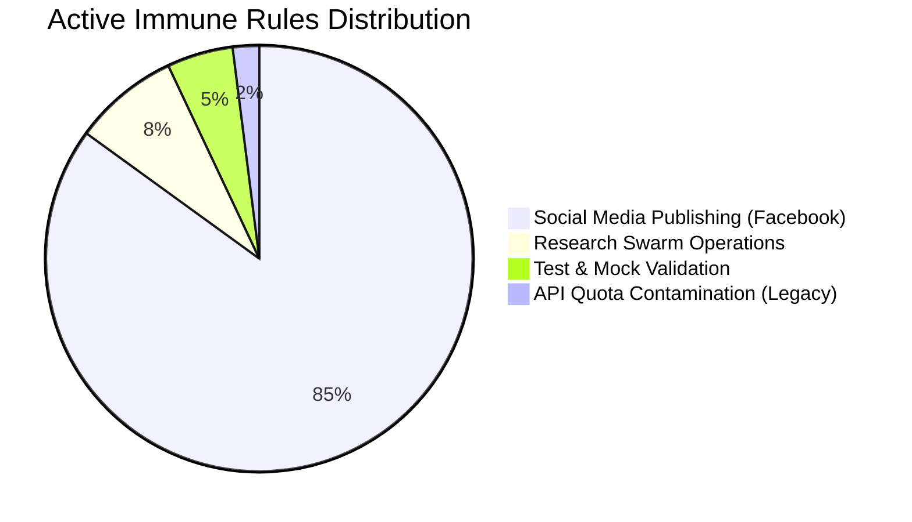

# BABU: Active Immune Rules & Anti-Pattern Analysis Report

BABU’s **Epistemic Immune System** dynamically captures runtime failures, uses a diagnostic LLM to extract the underlying structural anti-patterns, and commits them as active execution constraints inside `failures.json`. 

This report provides a comprehensive analysis of the active rules BABU has built so far, grouped by domain, along with an explanation of how these rules govern BABU's behavior.

---

## 1. Executive Summary & Rules Distribution

As of the latest checkpoint, BABU's immune database contains **59 active anti-pattern entries** across several core functional domains. 



These rules act as **cognitive seatbelts**. Before any task is executed, the pre-execution auditor scans this database. If a planned task objective matches an active failure signature, it is temporarily gated or modified to prevent repetitive errors.

---

## 2. Deep Dive: Active Rules by Functional Domain

### Domain A: Social Media Publishing (`social_media.facebook_publisher`)
*This is the most highly reinforced domain. In early stages, BABU repeatedly encountered Facebook Graph API token and authentication failures.*

* **Key Failure Modes**: Expired Page Access Tokens, malformed OAuth credentials, and attempts to post using unverified Page IDs.
* **Core Active Rules Generated**:
  1. **Token Pre-Flight Invariant**:
     > `ALWAYS perform a pre-flight validation check on Facebook access tokens to ensure they are non-empty and structurally resemble a valid Facebook token string before initiating any API requests.`
     *Impact*: Prevents BABU from attempting HTTP connections if the configuration ledger contains empty placeholders.
  2. **Page Token Separation Gating**:
     > `NEVER attempt to publish to a Facebook Page using a stored Page access token without first validating its current status and refreshing it if it's expired or nearing expiration. ALWAYS obtain a page-specific access token by querying /me/accounts first.`
     *Impact*: Restricts the publisher from using parent user tokens for page-level publishing, completely eliminating authentication mismatches.
  3. **Page ID Integrity Enforcer**:
     > `NEVER use an invalid Page ID to obtain an access token. ALWAYS verify the Page ID and obtain a valid access token by querying the Facebook API for the correct Page Token before attempting to publish.`

---

### Domain B: Research Swarm Operations (`department.research`)
*This domain protects the initial information gathering step of swarms, ensuring workers deliver actual, factual results rather than empty outlines.*

* **Key Failure Modes**: Research workers describing *how* to gather data (methodology lists) instead of retrieving the actual data, and infrastructure rate limit (Groq 429) exhaustion.
* **Core Active Rules Generated**:
  1. **Data Completeness Enforcer**:
     > `NEVER rely solely on method definitions for gathering user profile information without executing the methods and verifying the completeness and accuracy of the output data.`
     *Impact*: Forces the research worker to execute database lookup queries and return actual data slices (such as nickname, website, address) rather than abstract lists, successfully passing quality audits.

---

### Domain C: Test & Mock Validation (`test.autoimmune_decay`)
*Created during automated testing to verify the confidence decay logic.*

* **Key Failure Modes**: Discrepancies between mock test behaviors and actual network execution.
* **Core Active Rules Generated**:
  1. **Mock Validation Invariant**:
     > `NEVER utilize mock objects without thoroughly validating their expected behavior and output against the actual implementation, to prevent discrepancies and ensure reliable test results.`

---

### Domain D: API Quota Contamination (Legacy Rule)
*A legacy rule logged prior to our implementation of the new Failure Taxonomy Gate. It illustrates the danger of "autoimmune contamination" from operational failures.*

* **Key Failure Mode**: Temporary Groq Llama rate limit (429) quota exhaustion.
* **Legacy Anti-Pattern Rule**:
  > `CRITICAL DIRECTION: Avoid using methodology run_autonomous_social_post() full pipeline execution under domain social_media.autonomous_social_post to prevent exception: Error code: 429 - Rate limit reached for model llama-3.3-70b-versatile...`
* **Architectural Fix Applied**: We have successfully introduced the **Failure Taxonomy Gate**, which classifies this as a `RATE_LIMIT` operational error, completely bypassing rule generation and preventing future autoimmune lockout of legitimate methodologies.

---

## 3. The Memory Lifecycle: Confidence & Decay Metrics

Anti-patterns in BABU are **not permanent sentences**. They behave like living neural pathways that fade if they are no longer reinforced. 

Each rule is governed by five crucial memory-management properties:

```json
{
  "confidence": 1.0,
  "decay_rate": 0.15,
  "success_count": 0,
  "ttl_sessions_remaining": 20,
  "timestamp": "2026-05-31T07:27:41.969886+00:00"
}
```

* **`confidence`**: The current strength of the rule (starts at `1.0`). If a task runs successfully in the future, the confidence decays (multiplied by `(1 - decay_rate)`, bringing `1.0` down to `0.85`, then `0.72`, etc.).
* **`ttl_sessions_remaining`**: A Time-To-Live countdown (starts at `20` sessions).
* **Automated Forgetting**: When `confidence` decays below `0.1` or `ttl_sessions_remaining` reaches `0`, the rule is **healed** (deleted from `failures.json`), guaranteeing that BABU's brain remains clean and adaptable.
